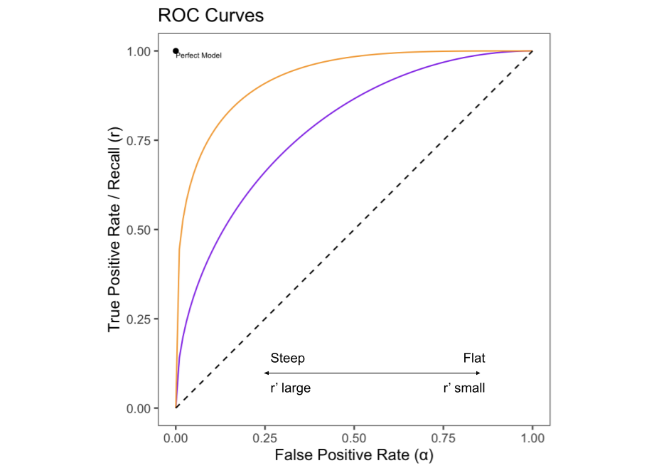

```{r include=FALSE}
library(tidyverse)
```

# TL;DR

- How to balance false positive rates and false negative rates is a problem that confronts anyone who does anything with machine learning, or even predicting more generally
- In this post, I explore how to make an optimal choice of FPR and FNR given your relative valuation of a false positive and a false negative
- I found it surprising that the optimal choice is determined _not only_ by your preferences over false positives and false negatives, but also by the probability distribution of the positive class
- Specifically, I show that if $\pi$ is the prevalence of the positive class and $u_{TP}, u_{TN}, u_{FP}, u_{FN}$ are utilities associated with True Positives, True Negatives, False Positives, and False Negatives, then you should choose a point on the ROC curve which satisfies

$$\text{ROC Slope} = \frac{1-\pi}{\pi} \frac{u_{TN}-u_{FP}}{u_{TP}-u_{FN}}$$

- I go through a worked example of how one might hypothetically go about applying this rule
- I also show how you can use this rule to derive your implicit preferences if you know the ROC slope and prevalence of the positive class
- I also [made a little calculator](https://colin-fraser.shinyapps.io/roc_eu_calculator/) to explore these relationships and continue to build my intuition

# Introduction

In a recent Slack thread at my work, a question was posed about whether we should prefer precision to accuracy. A long discussion ensued which eventually shifted to discussing the tradeoff between types of errors in predictive models. It's fairly well known that there is a trade-off between preventing false positives and allowing false negatives. Metaphorically, you can cast a very wide net, and you'll catch a lot of fish, but also a lot of boots. Or you can fish with a spear, which will get you a lot less boots, but also a lot less fish. Casting a wide net gets you high _recall_, but the price you pay is a high _false positive rate_. Spearfishing gets you a much lower false positive rate, but lower recall, too.

This tradeoff is everywhere. In almost any situation where you are using some automated process to identify some class of thing, you'll be faced with this tradeoff. This applies to systems that make guesses about whether your login attempt to a website is fraudulent, whether your image is contained in a photograph, whether your Facebook post is against Facebook's community standards, whether you're likely to renew your cell phone contract, and in all kinds of other ways that we're not even aware of. In each of these cases, the engineers building the systems have to made a decision about how many false positives they want to permit.

It's easy to see that this tradeoff always exists. You could stop all fraudulent logins to a website by preventing any user from ever signing on—this would get you 100% recall, but it would also get you a 100% false positive rate. You could achieve a 0% false positive rate by never flagging any signin attempt as fraudulent, then you'd have a 0% true positive rate. If you're building the fraudulent signin detector, you have to pick somewhere in between.

It's intuitive—and correct—that the best point for you will depend on your preferences over false positives and false negatives. If false positives are expensive, you should opt for a lower false positive rate; and vice versa. However, the conversation often just ends there. I've personally not seen (and I went looking) precise guidance on how to actually choose the best point along that continuum. This is what sent me on a quest to learn more about how to choose the best point along that frontier.

# Definitions and notation

Let $Y\in\{0,1\}$ be the real world event about which we are making predictions, and $\hat{Y}\in\{0,1\}$ the prediction made by our binary classifier. When a classifier predicts that a unit is positive, I'll say that the unit has been _flagged_. When a unit is flagged, there are two possibilities: either the unit is actually a positive, in which case we have a **true positive**, or the unit is actually a negative, in which case we have a **false positive**. Similarly, when a unit is not flagged, we end up either with a **true negative** or a **false negative**. This is summarized by the [confusion matrix](https://en.wikipedia.org/wiki/Confusion_matrix).


## Prevalence
The prevalence of the event is the frequency with which it occues. Formally, the prevalence of $Y$ is equal to $P(Y=1)$. Since $Y$ is a binary random variable, this can also be expressed as $E[Y]$. I will denote prevalence by $\pi$.


## True Positive Rate, False Positive Rate, and the ROC Curve

Every classifier, and indeed every machine learning model or predictive process, makes mistakes. When deciding whether to use a model, you need to balance the expected benefit of the correct predictions against the expected cost of the mistakes. One way to conceptualize these rates that I'll use for the rest of this post is the True Positive Rate (TPR) and the False Positive Rate (FPR). TPR is the probability that the classifier correctly flags a randomly selected positive case, and FPR is the probability that the classifier _incorrectly_ flags a randomly selected negative case.

$$
\begin{align}
\text{TPR} &= P(\hat{Y}=1|Y=1) \\
\text{FPR} &= P(\hat{Y}=1|Y=0) \\
\end{align}
$$

FPR is often also referred to as the Type I error rate and denoted by the Greek letter $\alpha$. I'll follow that convention here. TPR also has another name: recall. For that reason I will denote TPR by the letter $r$. (TPR is also sometimes referred to as the "sensitivity" of the classifier).

## The ROC Curve

In practice, it is often possible to tune a model in order to obtain a desired FPR and TPR. A typical way that this can be done is when the model outputs a score. Choosing to predict positive when the score is above some threshold $t$ will lead to a certain pair of TPR and FPR. Varying $t$ will lead to different corresponding pairs of TPR and FPR. Plotting TPR as a function of FPR gives the [Receiver Operating Characteristic (ROC) curve](https://en.wikipedia.org/wiki/Receiver_operating_characteristic), which is frequently used in the evaluation of machine learning models.

```{r echo=FALSE}
library(ggplot2)
roc_tpr <- function(tpr, p = 2) {
  (1 - (tpr - 1)^p)^(1/p)
}
ggplot() +
  geom_function(fun=roc_tpr, color = 'purple') +
  geom_function(fun= function(x) roc_tpr(x, 4), color = 'orange') +
  geom_function(fun = function(x) x, linetype = 'dashed') +
  coord_fixed() + 
  geom_segment(y=0, yend=1, x=0, xend=1) +
  ggthemes::theme_few() +
  xlim(0, 1) +
  labs(y = 'True Positive Rate / Recall (r)', x = 'False Positive Rate (α)', title = 'ROC Curves') +
  annotate(x=0, y=1, geom = 'point') +
  annotate(x=0, y=1, geom = 'text', label = 'Perfect Model', size=2, hjust=0, vjust = 1.3)
```

The figure above shows the ROC curve for two hypothetical models. It is common to plot the line $y=x$ on ROC plots—this represents the theoretical worst possible model, equivalent to simply flipping a coin. Models that outperform random guessing occupy the space above the 45-degree line. A theoretical perfect model would live at the point $(0,1)$: a model that flags every positive (TPR=1), while never incorrectly flagging a negative (FPR=0). In this case, the orange model is strictly better than the purple model, because at any given FPR, it can achieve a higher TPR. The closer the ROC curve is to the point (0,1), the better the model performs overall.


## Utility and Expected Utility

### Costs and Benefits of Predicting

As discussed above, when we use the classifier to make a prediction, there are four potential outcomes, which I'll denote by $TP$, $TN$, $FP$, $FN$. Each of these outcomes has some cost or benefit associated with it, which I'll describe as utilities, $u_{TP}$, $u_{TN}$, $u_{FP}$, $u_{FN}$. This utility function is reminiscent of a Payoff Matrix from elementary game theory.

<table class="table-no-highlight">
<thead><tr><th colspan="4">Classifier Payoff Matrix</th></tr>
</thead>
<tbody>
<tr><td colspan="2" rowspan="2"></td><td colspan="2"><strong>Predicted</strong></td></tr>
<tr><td>$\hat{Y}=1$</td><td>$\hat{Y}=0$</td></tr>
<tr><td rowspan="2"><strong>Actual</strong></td><td>$Y=1$</td><td>$u_{TP}$</td><td>$u_{FN}$</td></tr><tr><td>$Y=0$</td><td>$u_{FP}$</td><td>$u_{TN}$</td></tr></tbody>
</table>

The utilities associated with each outcome can vary significantly by domain. Fo instance, if the classifier is a COVID-19 test, then we might attach a higher cost to a false negative than to a false positive. While both are certainly costly, the damage done by a false positive is likely confined to the individual, who may be forced to unnecessarily quarantine—whereas, a false negative may lead the individual to infect others.

<table class="table-no-highlight">
<thead><tr><th colspan="4">Hypothetical COVID-19 Test Payoff Matrix</th></tr>
</thead>
<tbody>
<tr><td colspan="2" rowspan="2"></td><td colspan="2"><strong>Predicted</strong></td></tr>
<tr><td>$\hat{Y}=1$</td><td>$\hat{Y}=0$</td></tr>
<tr><td rowspan="2"><strong>Actual</strong></td><td>$Y=1$</td>
<!-- TP --> <td>$1$</td>
<!-- FN --> <td>$-10$</td>
</tr><tr><td>$Y=0$</td>
<!-- FP --> <td>$-1$</td>
<!-- TN  --><td>$1$</td>
</tr></tbody>
</table>

On the other hand, many for many applications a false positive might be significantly more costly than a false negative. For example, imagine the model behind Face ID on an iPhone. A false negative means that the model incorrectly fails to identify your face as a match to what you've stored. This causes annoyance; you may have to scan again, or even unlock your phone by an alternate method. However, a false positive means that a face which is not yours was able to unlock the phone. This is presumably significantly worse.

<table class="table-no-highlight">
<thead><tr><th colspan="4">Face ID Payoff Matrix</th></tr>
</thead>
<tbody>
<tr><td colspan="2" rowspan="2"></td><td colspan="2"><strong>Predicted</strong></td></tr>
<tr><td>$\hat{Y}=1$</td><td>$\hat{Y}=0$</td></tr>
<tr><td rowspan="2"><strong>Actual</strong></td><td>$Y=1$</td>
<!-- TP --> <td>$1$</td>
<!-- FN --> <td>$-1$</td>
</tr><tr><td>$Y=0$</td>
<!-- FP --> <td>$-10$</td>
<!-- TN  --><td>$1$</td>
</tr></tbody>
</table>

### Expected Utility

We can combine the entries in the payoff matrix to obtain an _expected utility_ $U$ of making a prediction. This represents the average overall benefit or cost that we expect to receive (or incur) by using the model for prediction.

$$U = P(TP)u_{TP} + P(TN)u_{TN} + P(FP)u_{FP} + P(FN)u_{FN} $$

It is useful to rewrite this in terms of more commonly used classifier evaluation metrics. To do this, I'll show how each probability in this term can be expressed as a combination of the prevalence $\pi$, the TPR $r$, and the FPR $\alpha$.

### Prediction Outcome Probability Identities

$P(TP) = r \pi$. This is easily derivable from the definition.

$$\begin{align}P(TP) &= P(\hat{Y}=1,Y=1) \\
&=P(\hat{Y}=1|Y=1)P(Y=1) \\
&=r\pi
\end{align}
$$
This makes some intuitive sense as well: the probability of a True Positive is equal to the rate at which the model correctly flags positives, multiplied by the prevalence of positives.

$P(TN) = (1-\pi)(1-\alpha)$. This can also be derived from the definitions.

$$\begin{align}P(TN) &= P(\hat{Y}=0,Y=0) \\
&=P(\hat{Y}=0|Y=0)P(Y=0) \\
&=\left(1-P(\hat{Y}=1|Y=0)\right)(1-\pi) \\
&=(1-\alpha)(1-\pi)
\end{align}
$$

This is similar. It says that the probability of a True Negative is equal to the probability of _not_ mis-flagging a negative, which is $1-\alpha$, multiplied by the probability of a negative, $1-\pi$.

$P(FP) = \alpha(1-\pi)$

$$\begin{align}P(FP) &= P(\hat{Y}=1,Y=0) \\
&=P(\hat{Y}=1|Y=0)P(Y=0) \\
&=\alpha(1-\pi)
\end{align}
$$
This one is simple, it says that the probability of a false positive is the False Positive Rate multiplied by the prevalence of negatives.

$P(FN) = (1-r)\pi$

$$
\begin{align}
P(FN) &= P(\hat{Y}=0,Y=1) \\
&= P(\hat{Y}=0|Y=1)P(Y=1) \\
&= [1-P(\hat{Y}=1|Y=1)]P(Y=1) \\
&= (1-r)\pi
\end{align}
$$

Similarly, this says that the probability of a False Negative is equal to the probability of failing to flag a positive, $1-r$, multiplied by the prevalence of positives.

# Maximizing Expected Utility Along the ROC Curve

Using the identities from the last section, we can rewrite the expected utility as follows.

$$
U=\pi u_{TP}r(\alpha) + \pi u_{FN}(1-r(\alpha)) + (1-\pi)u_{FP}\alpha  + (1-\pi)u_{TN}(1-\alpha)
$$

Given an ROC curve, a payoff matrix, and a prevalence, this allows us to plot the expected utility of a prediction alongside the ROC curve. The following plot shows a hypothetical ROC curve (parameterized as $r=\sqrt{2\alpha-\alpha^2}$ for simplicity) along with the expected utility at each point when prevalence is 0.5.

```{r echo=FALSE}
expected_utility <- function(alpha, pi, u_tp, u_tn, u_fp, u_fn, roc) {
  r <- roc(alpha)
  pi * (u_tp * r + u_fn * (1-r)) + (1-pi) * (u_fp * alpha + u_tn * (1-alpha))
}

tibble(
  alpha = 1:10000/10000,
  r = roc_tpr(alpha),
  eu_1 = expected_utility(alpha, pi = .5, 1, 1, -1, -1, roc_tpr)
) %>% 
  ggplot(aes(x = alpha, y = r)) + 
  geom_line(color = 'blue') +
  geom_line(aes(y = eu_1), color = 'orange') +
  coord_fixed() + 
  ggthemes::theme_few() +
  annotate(x = 1-sqrt(2)/2, y = expected_utility(1-sqrt(2)/2, pi = .5, 1, 1, -1, -1, roc_tpr), geom = 'point') +
  annotate(x = 1-sqrt(2)/2, y = roc_tpr(1-sqrt(2)/2), geom = 'point') +
  geom_vline(xintercept = 1-sqrt(2)/2, linetype = 'dashed') +
  annotate(x = .75, y = .9, color = 'blue', label = 'TPR', geom = 'text') +
  annotate(x = .75, y = .2, color = 'orange', label = 'Expected Utility of a Prediction', geom = 'text',
           size = 3) +
  annotate(label = "m* = (.29,.71)", x = 1-sqrt(2)/2, y = .71, geom = 'text', hjust=-.1) +
  labs(title = 'ROC Curve & Expected Utility', y = 'True Positive Rate / Expected Utility', x = 'False Positive Rate',
       caption = str_wrap('The blue curve is a hypothetical ROC curve given by TPR = sqrt(1-FPR^2). If we weigh true positives, true negatives, false positives, and false negatives equally, and if the prevalence of the positive class is 0.5, then the expected utility of a prediction is given by the orange curve. Under these assumptions, the point m* which maximizes expected utility corresponds to FPR=.29, TPR=.71.')) +
  theme(plot.caption = element_text(hjust=0))
  
```

To find the point along the ROC curve where expected utility is maximized, we can take the derivative of expected utility with respect to $\alpha$, and find the point where it's equal to 0 (assuming that the ROC curve is well-behaved, i.e. looks something like the characteristic bow-shape, is monotonic, etc.).

$$\frac{dU}{d\alpha} = \pi (u_{TP} - u_{FN})r'(\alpha) + (1-\pi)(u_{TN}-u_{FP}) $$

Setting this expression equal to $0$ and solving for $r'(\alpha)$ gives an interesting condition for the utility-maximizing point.

$$r'(\alpha) = \frac{1-\pi}{\pi}\frac{u_{TN}-u_{FP}}{u_{TP}-u_{FN}}$$

This equation tells us what must be true about the slope of the ROC curve at the point which maximizes the expected utility. Since well-behaved ROC curves look similar to each other, this gives us some heuristics that will be true for most models.

The ROC curve starts steep and becomes flat. Thus, when the right hand side of this equation is large, then the optimal point is somewhere on the left side of the ROC curve, where the curve is steep and the false positive rate is low. Conversely, when the right hand side is small, then the optimal point is somewhere on the right side of the ROC curve, where the FPR is high and the curve is flatter.

The utility term in this expression can be simplified further by reframing the utility function. The numerator $u_{TN}-u_{FP}$ can be understood as the cost incurred by switching from a TN to a FP. In other words, it's the marginal cost of incorrectly flagging a negative. I'll call this the Marginal Cost of a False Positive (MCFP). Similarly, the denominator $u_{TP}-u_{FN}$ can be understood as the marginal cost of incorrectly failing to flag a positive, or the Marginal Cost of a False Negative (MCFN). To further simplify the expression, I'll give this ratio MCFP/MCFN a name: the *Error Exchange Rate* (EER). This ratio represents the number of false positives that you would be willing to give up in order to prevent a false negative. In these terms, the optimality condition becomes

$$
\begin{align}r'(\alpha) &=\text{ROC slope} \\ &=
\frac{1-\text{prevalence}}{\text{prevalence}}\frac{\text{Marginal Cost of a False Positive}}{\text{Marginal Cost of a False Negative}} \\ &=\frac{1-\pi}{\pi}\frac{MCFP}{MCFN} \\ &=\text{odds}(Y=0) \times EER
\end{align}$$


## Key Point: The optimal point on the ROC curve is partly determined by prevalence

One of the primary determinants of the optimal point along the ROC curve is the prevalence of the positive class. I always thought that the optimal choice of classifier would be determined solely by preferences over false positives and false negatives, but on reflection it makes sense: you should optimize with respect to your relative valuation of errors _and_ with respect to the expected volume of errors that will be produced by your choice. This latter aspect is not determined by your valuation over errors, but rather by how common negatives are in the data.

Since the optimality condition sets the slope of the ROC curve _proportional_ to the odds of a negative, the optimal slope as a function of prevalence always has the same shape. Differences in the valuation of errors simply scale the function vertically.

```{r echo=FALSE, message=FALSE}
tibble(x=1:100/100, y = (1-x)/x) %>% 
  ggplot(aes(x=x, y=y)) +
  geom_line() +
  ggthemes::theme_few() + 
  labs(x = 'Prevalence', y = 'Optimal TP/FP Tradeoff', title = 'Optimal ROC Slope',
       caption = str_wrap('This plot shows the optimal slope of the ROC curve at every possible prevalence. Since the optimal ROC slope as a function of prevalence is proportional to a EER, which is constant, this function always has this shape.', 90)) +
  theme(plot.caption= element_text(hjust=0), plot.caption.position = 'panel',
        axis.text.y = element_blank(), axis.ticks.y = element_blank())
```

To help understand how this manifests, the following plot shows a hypothetical ROC curve (defined as $r(\alpha)=\sqrt{2\alpha - \alpha^2}$, which is just a quarter-circle with radius 1 centered at (1,0)) along with the expected utilities and optimal points assuming the same utilities, but different prevalences. For simplicity I assume that EER=1, but alternative EERs would produce similar qualitative results.

(Fun calculus exercise: show that these assumptions imply that the optimal recall as a function of prevalence is equal to $\alpha^* = \frac{2\pi^2 - \sqrt{2\pi ^4 - 6\pi ^3 + 7\pi^2 - 4\pi + 1}}{2\pi^2 - 2\pi + 1}$)


```{r echo=FALSE, warning=FALSE}
roc_2 <- function(alpha) {
  sqrt(2*alpha - alpha^2)
}

opt_alpha <- function(pi) {
  pi2 <- pi^2
  
  (2*pi^2 - sqrt(2*pi^4 - 6*pi^3 + 7 * pi^2 - 4 * pi + 1) - 2*pi + 1) / (2 * pi^2 - 2*pi + 1)
}

eu_2 <- function(x, pi) expected_utility(x, pi, 1, 1, -1, -1, roc_2)

ggplot() +
  geom_function(fun=roc_2) +
  geom_function(fun = function(x) eu_2(x, .25), linetype = 'dotted', color = 'blue') +
  geom_function(fun = function(x) eu_2(x, .75), linetype = 'dotted', color = 'orange') +
  geom_function(fun = function(x) eu_2(x, .5), linetype = 'dotted', color = 'red') +
  annotate(x = opt_alpha(.25), y = roc_2(opt_alpha(.25)), geom = 'point', color = 'blue') + 
  annotate(x = opt_alpha(.25), y = eu_2(opt_alpha(.25), .25), geom = 'point', color = 'blue') +
  annotate(x = opt_alpha(.25), y = roc_2(opt_alpha(.25)), geom = 'point', color = 'blue') + 
  annotate(x = opt_alpha(.25), y = eu_2(opt_alpha(.25), .25), geom = 'point', color = 'blue') +
  annotate(x = opt_alpha(.25), y = roc_2(opt_alpha(.25)), 
           geom = 'text', color = 'blue', 
           label = str_glue('m*=({round(opt_alpha(.25),2)}, {round(roc_2(opt_alpha(.25)),2)})'),
           size=2, hjust=0, vjust=1.3) +
  annotate(x = opt_alpha(.75), y = roc_2(opt_alpha(.75)), geom = 'point', color = 'orange') + 
  annotate(x = opt_alpha(.75), y = eu_2(opt_alpha(.75), .75), geom = 'point', color = 'orange') +
  annotate(x = opt_alpha(.75), y = roc_2(opt_alpha(.75)), geom = 'point', color = 'orange') + 
  annotate(x = opt_alpha(.75), y = eu_2(opt_alpha(.75), .75), geom = 'point', color = 'orange') +
  annotate(x = opt_alpha(.75), y = roc_2(opt_alpha(.75)), 
           geom = 'text', color = 'orange', 
           label = str_glue('m*=({round(opt_alpha(.75),2)}, {round(roc_2(opt_alpha(.75)),2)})'),
           size=2, hjust=0, vjust=1.3) +
  annotate(x = opt_alpha(.5), y = roc_2(opt_alpha(.5)), geom = 'point', color = 'red') + 
  annotate(x = opt_alpha(.5), y = eu_2(opt_alpha(.5), .5), geom = 'point', color = 'red') +
  annotate(x = opt_alpha(.5), y = roc_2(opt_alpha(.5)), geom = 'point', color = 'red') + 
  annotate(x = opt_alpha(.5), y = eu_2(opt_alpha(.5), .5), geom = 'point', color = 'red') +
  annotate(x = opt_alpha(.5), y = roc_2(opt_alpha(.5)), 
           geom = 'text', color = 'red', 
           label = str_glue('m*=({round(opt_alpha(.5),2)}, {round(roc_2(opt_alpha(.5)),2)})'),
           size=2, hjust=0, vjust=1.3) +
  ylim(0, 1) +
  xlim(0,1) +
  coord_fixed() +
  ggthemes::theme_few() +
  labs(title = 'Prevalence, ROC Curves and Expected Utility', x = 'FPR', y = 'TPR/Expected Utility',
       caption = str_wrap("This plot shows how the optimal point along the ROC curve varies as a function of prevalence. The black curve is a hypothetical ROC curve. The dotted curves are hypothetical expected utility curves assuming different levels of prevalence. At low prevalence (blue, prevalence=.25), the optimal point is quite far to the left relative to high prevalence (orange, .75), implying a lower tolerance for false positives at low prevalence. For prevalence =.5 (red), the optimal point is exactly half way along the utility curve.")) +
  theme(plot.caption = element_text(hjust=0), legend.position = 'none')
  
```

Although this exercise is contrived (by me), I still found the results a little surprising when I first went through this. Since it's well known that ROC curves are "better" the closer they get to the point (1,0), I would have expected that when we are indifferent between a false positive and a false negative, the optimal point should be at the point along the ROC curve that is closest to the point (1,0). But this is only true in the specific case where prevalence is 0.5. In general, the optimal point can be anywhere along the ROC curve—further to the left when prevalence is low, and further to the right when prevalence is high.

### The optimal point on the ROC curve is determined by your preferences

The preferences, of course, also determine the optimal point along the ROC curve. The optimal point is fully determined by the prevalence and your EER, so you don't actually even need to fully specify all four utility values—you just need to know the EER ratio.

The EER is the number of false positives you would need to prevent in order to allow a single false negative. If this is greater than 1, it's because a false positive is costlier to you than a false negative, and vice versa. It can be challenging to come up with an exact value for this, but it can be instructive to try out some values, plug them in, and see what it does to the optimal ROC point. 

### Putting it together

To choose the optimal point on the ROC curve, you need a prevalence and an EER. Since the function for deriving the optimal ROC slope from the prevalence and EER is pretty simple, it's possible to derive some simple heuristics for developing intuition about optimal classifiers. When prevalence is low, $(1-\pi)/\pi$ is high. If EER is also high, then the optimal slope is given by a big number times a big number, which is a big number. This implies that for low prevalence and high EER, the optimal point will be somewhere towards the left side of the ROC curve, where it's steep. A similar argument can be made when prevalence is high and EER is low.

<table style="all: revert;"><tbody><tr><td colspan="2" rowspan="2"></td><td colspan="2">EER</td></tr><tr><td>High</td><td>Low</td></tr><tr><td rowspan="2">Prevalence</td><td>High</td><td>Depends</td><td>High Recall, Low Precision</td></tr><tr><td>Low</td><td>Low Recall, High Precision</td><td>Depends</td></tr></tbody></table>

These rules of thumb do make some intuitive sense. When EER is high, it means that a False Positive is costlier than a False Negative. When prevalence is low, it means that there are lots of opportunities for false positives. So when both of those things are true, we should definely choose a classifier that produces a minimal volume of false positives—which would be one with high precision and low recall.

On the other hand, suppose we have high EER but also high prevalence, so we are in the top left quadrant. In this case, a false positive is costlier than a false negative, but there aren't as many opportunities for false positives. There's not enough information to determine whether we should choose higher precision or higher recall here; we'll need to see the specific value.

# Worked Example

## Deriving implied preferences

Throughout this piece, I've assumed that we have readily available values for the costs and benefits of hits and errors. In practice, this is rare. In most of my experience with machine learning applications, classifier thresholds have been chosen on the basis of an intuitive sense about the relative costs of errors, but without actually explicitly defining those costs and performing these assessments.

In these cases, it may be a useful exercise to apply these rules in the other direction: rather than taking the utility function and prevalence to select the optimal point along the ROC curve, we might assume that we've chosen the optimal point already, and use that point and the prevalence to derive the implied EER.

As an example, suppose you've got a model for predicting customer churn. Based on gut feeling, you've calibrated the model to have a 10% false positive rate, which gets 44% recall. Suppose further that the population customer churn rate is 5%.

```{r echo=FALSE, warning=FALSE}
roc <- function(x) sqrt(2*x - x^2)
roc_prime <- function(x) {(1 - x) / sqrt(2*x - x^2)}
tangent <- function(x1) {function(x) roc_prime(x1) * (x - x1) + roc(x1)}
X <- .1
Y <- roc(X)
ggplot() +
  geom_function(fun = roc) +
  geom_abline(linetype = 'dashed') +
  geom_function(fun = tangent(X), linetype = 'dotted', color = 'blue') +
  annotate(x = X, y = Y, geom = 'point', color = 'blue') +
  xlim(0,1) + 
  ylim(0,1) +
  coord_fixed() +
  ggthemes::theme_few() +
  labs(x = 'FPR', y = 'TPR', title = 'A selected point along the ROC curve') +
  annotate(x = X, y = Y, hjust = 0, vjust = 1.5, label = str_glue("({round(X,2)}, {round(Y,2)})"),
           geom = 'text', size = 2, color = 'blue') +
  annotate(x =.2, y = tangent(X)(.2), geom = 'text', 
           label = str_glue('slope = {round(roc_prime(X), 2)}'),
           size = 2, color = 'blue', hjust = 1.1)
  
```
We can use this information to calculate the EER that's implied by these numbers. The trickiest part here is determining the slope of the ROC curve at the point we've selected. For this example I cheated a little bit by specifically contriving a nice ROC curve $r = \sqrt{2\alpha - \alpha^2}$. It's (relatively) easy to apply some calculus 101 and determine that the slope of that curve at $\alpha=0.1$ is about 2.06. In real life, it will be a little bit harder to find this slope, and the best approach for doing this might be the subject of a future post. But anyway, if we have the slope, then we just plug the numbers into the optimality condition to derive our implied relative valuation of False Positives and False Negatives.

$$
\begin{align}
r'(\alpha) &= \text{odds}(Y=0) \times EER \\
2.06 &= \frac{1-5\%}{5\%} \times EER \\
EER &= \frac{2.06}{19} = 0.108
\end{align}
$$

An EER of less than 1 implies that we value false negatives more highly than false positives; in particular, it means that a false negative is worth about $1/1.08\approx 9$ false negatives. Now we might take a step back and think about whether this makes sense for our particular application. Does this valuation make sense?

## Finding an optimal point given explicit preferences

Suppose we use these predictions to send out a promotional offer to customers who we think are likely to churn. In this case, it might be feasible to explicitly price false positives and false negatives (this is, of course, rare!). 


<table class="table-no-highlight">
<thead><tr><th colspan="4">Churn Model Payoff Matrix</th></tr>
</thead>
<tbody>
<tr><td colspan="2" rowspan="2"></td><td colspan="2"><strong>Predicted</strong></td></tr>
<tr><td>$\hat{Y}=1$</td><td>$\hat{Y}=0$</td></tr>
<tr><td rowspan="2"><strong>Actual</strong></td><td>$Y=1$</td>
<!-- TP --> <td>$450$</td>
<!-- FN --> <td>$0$</td>
</tr><tr><td>$Y=0$</td>
<!-- FP --> <td>$900$</td>
<!-- TN  --><td>$1000$</td>
</tr></tbody>
</table>

From here we can determine our actual EER:

$$EER = \frac{MCFP}{MCFN} = \frac{1000-900}{450-0}=0.222$$
Since this differs from our implied EER, we've chosen a suboptimal point along the ROC curve. We should choose a point according to the optimality condition $r'(\alpha) = \frac{1-\pi}{\pi} \times EER = 19 \times 0.222 = 4.22$. Since we are currently at a point where the slope is 2.06, we need to move along the curve towards a steeper region—which, given the shape of the curve, will be further to the left, where the false positive rate is lower.

The way to interpret this is that we are currently permitting too many false positives. Even though a single false positive is _less_ costly (\\$100) than a single false negative (\\$450), since the prevalence is quite low, there are way more opportunities for false positives than false negatives. To account for this, we have to limit the false positive rate at the expense of recall.

```{r echo=FALSE, warning=FALSE}

roc <- function(x) sqrt(2*x - x^2)
roc_prime <- function(x) {(1 - x) / sqrt(2*x - x^2)}
tangent <- function(x1) {function(x) roc_prime(x1) * (x - x1) + roc(x1)}
X <- .1
Y <- roc(X)
x_star <- 0.0269197125099906
y_star <- roc(0.0269197125099906)
p1 <- ggplot() +
  geom_function(fun = roc) +
  geom_abline(linetype = 'dashed') +
  xlim(0,1) + 
  ylim(0,1) +
  coord_fixed() +
  ggthemes::theme_few() +
  labs(x = 'FPR', y = 'TPR', title = 'ROC') +
  geom_function(fun = tangent(X), linetype = 'dotted', color = 'blue') +
  annotate(x = X, y = Y, geom = 'point', color = 'blue') +
  annotate(x = X, y = Y, hjust = 0, vjust = 1.5, label = str_glue("({round(X,2)}, {round(Y,2)})"),
           geom = 'text', size = 2, color = 'blue') +
  annotate(x =.2, y = tangent(X)(.2), geom = 'text', 
           label = str_glue('slope = {round(roc_prime(X), 2)}'),
           size = 2, color = 'blue', hjust = 1.1) +
  geom_function(fun = tangent(x_star), linetype = 'dotted', color = 'orange') +
  annotate(x = x_star, y = y_star, geom = 'point', color = 'orange') +
  annotate(x = x_star, y = y_star, hjust = 0, vjust = 1.5, label = str_glue("({round(x_star,2)}, {round(y_star,2)})"),
           geom = 'text', size = 2, color = 'orange') +
  annotate(x =.15, y = tangent(x_star)(.15), geom = 'text', 
           label = str_glue('slope = {round(roc_prime(x_star), 2)}'),
           size = 2, color = 'orange', hjust = 1.1) 

eu <- function(x) expected_utility(x, .05, 450, 1000, 900, 0, roc)
p2 <- ggplot() +
  geom_function(fun = eu) +
  xlim(0,.5) + 
  ggthemes::theme_few() +
  labs(x = 'FPR', y = 'Expected Utility', title = 'Expected Utility') +
  annotate(x = X, y = eu(X), geom = 'point', color = 'blue') +
  annotate(x = x_star, y = eu(x_star), geom = 'point', color = 'orange')

library(patchwork)
p1+p2
```

This type of result was a little bit surprising and counterintuitive to me when I first came across it. Intuitively I feel like if a false negative is more costly than a false positive, then I should be willing to give up some false positives in order in order to get a high recall. But in this example, we have a case where false negatives are costlier than false positives, and yet the optimal recall is only 0.03. The reason, again, is that it is not simply the relative valuation of false positives and false negatives that determines the total expected utility, _but also their relative frequencies_—which is determined by prevalence. Even if a single false positive doesn't cost very much, a flood of false positives can add up. If my classifier is permitting a flood of false positives, I might be able to do better by choosing a lower false positive rate at the expense of permitting some false negatives.

# The Complicated Real World

My purpose in going through all of this was to build my intuition and derive some heuristics for thinking about the TPR/FPR tradeoffs in typical cases. However, there is a lot left out. I won't address these points here, but I want to at least acknowledge them.

## Uncertainty and Randomness

In real life, you don't actually know the _real_ ROC curve, if such a thing is even well-defined. Models are evaluated on some test dataset, and the ROC curve displayes statistical estimates of the FPR and TPR with respect to the population from which the validation set is sampled. If you get a new test set, you'll get a new ROC curve. If the test set is sampled from the population on which the model will be running, then the resulting ROC curve and other model diagnostic statistics should be representative of what will be observed online. However, this often isn't the case: it's often desirable to sample cases which is are representative of the population, but which exemplify certain edge cases or ambiguous cases that you want the model to learn. In this case, the ROC and prevalence measured in the test set may not give a good representation of the actual tradeoffs that you face when selecting a point along the ROC curve.

But even if the test set is representative of the population, we are still subject to uncertainty: it's impossible to know the _true_ TPR and FPR of your model. You can only know the performance on a sample of data, and you have to hope that this is a good estimate of its performance on the full population. Of course, there are ways to quantify your uncertainty and account for this—that's basically the fundamental probablem of statistics—but it's not at all _obvious_ how. I don't address this here, but it'll probably make a good topic for some future hypothetical post.

## ROC curves aren't that nice

To make things straightforward (and partly out of some nostalgia for Calculus 101), I've worked with nice smooth ROC curves somewhat idealized for doing calculus with. In real life, ROC curves are derived from empirical data, and are drawn with step functions, meaning all the calculus stuff I've been doing here goes out the window.


It will be less straightforward to determine the optimal point along one of these real-world empirical ROC curves than what I've shown here, and how exactly to do it could be the subject of some future post. Nonetheless, the general intuition and principles should apply. When False Positives are expensive and prevalence is low, we should choose a point towards the left; when they are cheap and prevalence is high, we should choose a point towards the right. Holding everything else equal, when prevalence goes up, the optimal recall also goes up, and vice versa. But that brings me to the next complication.

## Everything Else Isn't Equal

I've mentioned a few times that holding everything else equal, when prevalence goes down then we should choose a point further to the left on the ROC curve. However, in a certain sense, this statement doesn't actually make any sense. When prevalence changes, the TPR and FPR will also change—meaning, the ROC itself will change. It would actually be very unusual to see prevalence shift but keep the ROC entirely unchanged.

The point here isn't to develop a general theory about the relationship between ROC's, prevalence, and utility (maybe one day but not today), but simply to figure out how to think about a specific but very common case: you have a ROC curve, and you have (implicit or explicit) preferences over false positives and false negatives, and you need to choose a point along the ROC curve. This piece provides a way to conceptualize this problem, but doesn't really explore what happens if the prevalence changes.

## Constant marginal utility is probably not realistic at scale

One of the implicit assumptions I use throughout this post is that marginal utility is constant with respect to the number of predictions made. For instance, in the worked example I assume that every false positive has a net cost of \\$100, so 1 false positive costs \\$100, 100 false positives costs \\$10,000, and a million false positives costs a hundred million dollars.

This is probably not realistic, and depending on the application, it probably becomes less and less realistic as you scale up. Suppose we have a model that prevents a user from signing in if it predicts that the sign-in attempt is fraudulent. A single false positive probably creates some annoyance for the user, and might cost us in terms of however much it costs to provide support to unlock the user's account. But after three or four false positives, the user's annoyance might boil over into a decision to stop trying to sign in at all, costing us an active user in the long term. In this case, the cost of a first false positive is somehow less than the cost of the second or third false positives. This type of cost function is not represented at all by this model, and could also be a topic for some future post.

# Conclusion

Going through this exercise was extremely helpful for me. I don't think I really had a strong intuition about this particular problem until I took the time to do this. It makes a lot of sense that we should choose a high precision classifier when false positives are expensive, and high recall when they are cheap, but the degree to which this is mediated by the underlying distribution of the positive class was not obvious to me at all prior to this adventure. I hope some other people out there feel similarly and that this can be a useful starting point for figuring out how to deal with classifiers in production when there are real costs to errors.