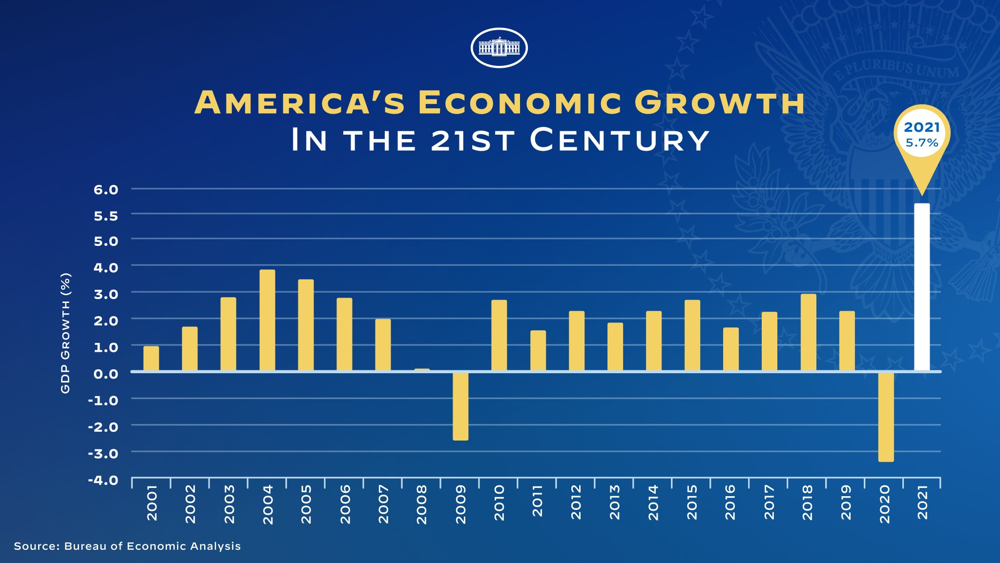

The White House Twitter account posted a bad chart yesterday.



In case you don't see it the first time around, the chart is bad because the vertical axis counts by 1's up to 5.0, and then inexplicably switches to .5's. This just so happens to have the effect of stretching only the bar that they wanted to highlight, making the recovery look bigger by comparison than it ought to have. I tweeted that I would not even know how to make such a chart.

```{r echo=FALSE}
blogdown::shortcode("tweet", "1486773908502024192")
```
 
Unless the White House is drawing charts manually in PowerPoint or something (which, to be honest, it seems like they probably are), it would actually very hard to make a chart that does this. Most plotting software works hard to make sure that plot axes are drawn to some scale, and that that scale doesn't change midway through the axis. Continuing on riffing as we like to do on Twitter, I tweeted that in ggplot2, it might look something like this.

<blockquote class="twitter-tweet tw-align-cente" data-conversation="none"><p lang="tl" dir="ltr">gdp_plot +<br> scale_y_propaganda()</p>&mdash; Colin Fraser  (@colin_fraser) <a href="https://twitter.com/colin_fraser/status/1486774482052141056?ref_src=twsrc%5Etfw">January 27, 2022</a></blockquote> <script async src="https://platform.twitter.com/widgets.js" charset="utf-8"></script>

Curiosity then took over, and I began to wonder how one would actually go about creating the `scale_y_propaganda()` function. It turns out that it is possible, and although you have to really shoehorn it in there, ggplot2 is flexible enough to do it relatively straightforwardly. In recreating the plot I also learned a thing or two about how ggplot2 axis labeling works, so I thought it might be worth writing up a little thing about it.

**Note:** _Although I use the term "propaganda" a lot in this piece, it is tongue-in-cheek and I am not accusing anyone of malicious wrongdoing of any kind in the creation of the original plot. The point of this post is not to make any kind of political statement; it's just to do kind of a wacky R tutorial and learn something about `ggplot`. I completely buy that it was an error due to a failure to proofread as they later stated._

```{r echo=FALSE}
blogdown::shortcode("tweet", "1486838940707524617")
```

_It's a little hard for me to imagine how an error like this would be made, but I believe it. If anyone from The White House is reading, I'm happy to jump on Zoom and do a quick ggplot2 tutorial to help avoid this kind of thing in the future._

## The data

I found a time series of the US annual GDP growth rate from World Bank.

<iframe src="https://data.worldbank.org/share/widget?end=2020&indicators=NY.GDP.MKTP.KD.ZG&locations=US&start=1961&view=chart" width='450' height='300' frameBorder='1' scrolling="no" style="margin: 0 auto;"></iframe>


It doesn't have 2021, so I just stuck that onto the end. I'll spare you the hassle of recreating the dataset on your own; here's a block of code that recreates the data that I work with here.
```{r}
library(tibble)
df <- tibble(
  year = c(2001, 2002, 2003, 2004, 2005, 2006, 2007, 
           2008, 2009, 2010, 2011, 2012, 2013, 2014, 
           2015, 2016, 2017, 2018, 2019, 2020, 2021),

  gdp_growth = c( 0.998,  1.742, 2.861, 3.799, 3.513,  2.855, 1.876, 
                 -0.137, -2.537, 2.564, 1.551, 2.25,   1.842, 2.526, 
                  3.076,  1.711, 2.333, 2.996, 2.161, -3.642, 5.7)
)
```

## Understanding The Bad Chart

The first step in recreating the Bad Chart is to understand it, so that we can describe it to ggplot2. In ggplot2, we think about data visualization as mapping numeric variables to the aesthetic dimensions of the `geom`s. In this case, we're going to work with a bar chart ([`geom_col`](https://ggplot2.tidyverse.org/reference/geom_bar.html)), with the year mapped to the horizontal position, and the height of the bars mapped to the GDP growth variable. But somehow, at `gdp_growth`=5, the mapping changes to double the rate at which height increases with GDP growth.

<pre><code class="nohighlight">
6.0 \  
5.5  | - height increases at 2 units per GDP growth percentage point
5.0 /
4.0  \
3.0   |
2.0   | - height increases at 1 unit per GDP growth percentage point
1.0   |
0     |
-1.0 /
</code>
</pre>

The most obvious way to describe this relationship is using a piecewise linear function. Letting $p(x)$ represent the propagandized bar height for a `gdp_growth` of `x`, we can write:

$$p(x)=\begin{cases}x & x<5 \\ 2x-5 & x \geq 5\end{cases}$$
However as we will see later, it's actually more convenient to express this in a slightly different format, making use of an indicator variable rather than using distinct cases.

$$p(x) = x + \mathbb{1}_{x\geq 5}(x - 5)$$

This function gives the height of the propagandized bar given a value of GDP growth, which will allow us to draw the bars. But to label the y-axis, we will also need a function that takes us the other direction: for a given (actual) bar height, we need to know what to label the (propagandized) y-axis at that point. Recalling some definitions from pre-calculus, this is exactly the definition of the inverse function of $p$.

$$p^{-1}(x)=x + \mathbb{1}_{x \geq 5} \frac{(5 - x)}{2}$$

To recreate The Bad Chart, we'll need to use both of these. Let me code those up in R right here.

```{r}
to_propaganda_height <- function(x) {
  x + (x >= 5) * (x - 5)
}

from_propaganda_height <- function(x) {
  x + (x >= 5) * (5 - x)/2
}
```

You can see why writing the functions using indicator functions rather than piecewise was convenient—it lets us write the functions as one-liners, taking advantage of the fact that in R, the logical vector `(x >= 5)` will be coerced to numeric when we multiply by a numeric vector. Also, crucially, these functions are magically _vectorized_, so they will take a vector of numbers `x` and apply the function element-wise.

```{r message=FALSE, warning=FALSE}
library(dplyr)
tibble(original_value = seq(0, 7, .5)) |> 
  mutate(to_propaganda = to_propaganda_height(original_value)) |> 
  mutate(from_propaganda = from_propaganda_height(to_propaganda))
```

## Creating `scale_y_propaganda`

An incredibly convenient set of tools from `ggplot2` is the family of `scale_` functions, e.g. `scale_y_log10`, `scale_x_sqrt` and so on. These allow one to apply transformations to the underlying data, and ensure that the labels are adjusted accordingly. If you're not familiar, here's a quick example of `scale_*_log10` in action, using the ever-helpful `diamonds` dataset from `ggplot2`.

```{r}
library(ggplot2)
ggplot(diamonds, aes(x = carat, y = price)) + 
  geom_point() +
  labs(title = "Without the log transform")
```

```{r}
ggplot(diamonds, aes(x = carat, y = price)) + 
  geom_point() +
  scale_x_log10() + 
  scale_y_log10() +
  labs(title = "With the log transform")
```

Applying `scale_x_log10` and `scale_y_log10` here reveals something very interesting and insightful about this dataset: the logarithm of the price of a diamond is linearly related to the logarithm of its weight. Of course, there's another way that we could see this as well.

```{r}
ggplot(diamonds, aes(x = log(carat), y = log(price))) + 
  geom_point() +
  labs(title = "Applying the log transform to each variable independently")
```

The marks in this plot are laid out in the exact same way as the previous plot, but notice the axis labels: the logarithms of the price and weight are labeled on the chart, rather than the original un-transformed values. The magic of `scale_*_log10` (and company) is that the `log10` transformation is applied to the variables _and_ the _inverse_ of that transformation is applied to the labels, so that the labels correspond to the original non-transformed values.

I would like to make something similar for my recreation of The Bad Chart. I can get the chart to be _visually_ correct using what I've already done.

```{r}
ggplot(df, aes(x = year, y = to_propaganda_height(gdp_growth))) + 
  geom_col()
```

You can see that the most recent bar appears to be the desired height here. The actual value is 5.7, but to match The Bad Chart, I want to draw it as though it's a bit taller than 6, which is accomplished here. But the labels are wrong. I want to label it as though it's 5.7 at the same time as I draw it to be a bit taller than 6.

To see how to do this, I referred to how `scale_y_log10` works. A useful thing to do interactively is to just type the name of a function, which will print its definition.

```{r}
scale_y_log10
```

Interesting! A bit of digging reveals that `log10_trans()` comes from the `scales` package. Let's go deeper.

```{r}
library(scales)
log10_trans
```

Deeper.

```{r}
log_trans
```

Fascinating and really very elegant, in my opinion. The `log_trans` function invokes this `trans_new` function, which is the constructor for something called a `trans` object. From `?trans_new`:

> #### Description
> A transformation encapsulates a transformation and its inverse, as well as the information needed to create pleasing breaks and labels. The breaks function is applied on the transformed range of the range, and it's expected that the labels function will perform some kind of inverse transformation on these breaks to give them labels that are meaningful on the original scale.

It makes a lot of sense that this `trans` object takes a transformation function and its inverse, since we need both of those in order to draw the plot: we need the transformation to figure out where to draw the points, and we need the inverse transformation to figure out how to label the axes. Since we've already figured out the transformations, it looks like we have everything we need to make The Bad Chart.


```{r}
transform_propaganda <- trans_new(
  name = "transform_propaganda",
  transform = to_propaganda_height,
  inverse = from_propaganda_height
)
scale_y_propaganda <- function(...) {
  scale_y_continuous(..., trans = transform_propaganda)
}
ggplot(df, aes(x = year, y = gdp_growth)) +
  geom_col() +
  scale_y_propaganda()
```

Looking better-ish, but what happened to the labels? The labels are determined by the `breaks` argument to `trans_new`, and by default they are set to a function called `extended_breaks` which uses some heuristics to find some more-or-less pleasing-looking equally-spaced breaks. But `transform_propaganda` seems to freak out the default breaks algorithm, which makes sense: the default algorithm looks for equally-spaced breaks, but the very definition of "equally-spaced" is interrupted at 5 here. So I'll need to write my own breaks algorithm.

Writing a custom breaks algorithm is pretty straightforward. You write a function that accepts a vector of length 2, where the first element is understood to be the minimum value displayed on the axis, and the second is understood to be the maximum value. The function should return a vector of numbers that will be used to label the axis.

In this case, what I want is a function which counts by 1's up to 5, and then starts counting by 0.5's.

```{r}
propaganda_breaks <- function(x) {
  lowest <- floor(x[1])
  highest <- ceiling(x[2])
  if (highest <= 5 || lowest >= 5.5) {
    return(seq(lowest, highest, by = 1))
  }
  lt5 <- seq(lowest, 5, by = 1)
  gt5 <- seq(5.5, highest, by = 0.5)
  c(lt5, gt5)
}
propaganda_breaks(c(-4, 6))
```

Perfect. So here's everything put together.


```{r}
to_propaganda_height <- function(x) {
  x + (x >= 5) * (x - 5)
}

from_propaganda_height <- function(x) {
  x + (x >= 5) * (5 - x) / 2
}

propaganda_breaks <- function(x) {
  lowest <- floor(x[1])
  highest <- ceiling(x[2])
  if (highest <= 5 || lowest >= 5.5) {
    return(seq(lowest, highest, by = 1))
  }
  lt5 <- seq(lowest, 5, by = 1)
  gt5 <- seq(5.5, highest, by = 0.5)
  c(lt5, gt5)
}

transform_propaganda <- trans_new(
  name = "transform_propaganda",
  transform = to_propaganda_height,
  inverse = from_propaganda_height,
  breaks = propaganda_breaks
)
scale_y_propaganda <- function(...) {
  scale_y_continuous(..., trans = transform_propaganda)
}

ggplot(df, aes(x = year, y = gdp_growth)) + 
  geom_col() + 
  scale_y_propaganda(limits = c(-4, 6))
```

## Some finishing touches

My main goal was to try to reproduce the y-scale but for the sake of completeness, here are some tweaks to make this look more like the original. There are a few elements of the original that I couldn't quite get to work, but this is pretty close.

```{r}
BLUE <- "#163E82"
GOLD <- "#F2D275"
WHITE <- "#FAFFF9"
ggplot(df, aes(x = year, y = gdp_growth, fill = year == 2021)) + 
  geom_col(width = .5, show.legend = FALSE) + 
  labs(title = "America's Economic Growth", subtitle = 'In The 21st Century',
       y = 'GDP Growth (%)', caption = 'Source: World Bank / colin-fraser.net. Made in R with ggplot2.') +
  scale_fill_manual(values = c(GOLD, WHITE)) +
  scale_y_propaganda(limits = c(-4, 6)) +
  scale_x_continuous(breaks = 2001:2021, expand = expansion(0.02)) +
  geom_hline(yintercept = 0, color = WHITE, size = 1) +
  theme_void() +
  theme(text = element_text('Verdana', color = WHITE), 
        plot.background = element_rect(fill = BLUE), plot.margin = unit(c(.2, 1, .2, 1), 'cm'),
        plot.title = element_text(color = GOLD, face = 'bold', size = 20, hjust = .5),
        plot.subtitle = element_text(size = 16, hjust = .5),
        plot.caption = element_text(hjust = 0, size = 8, margin = margin(20, 0, 0, 0)),
        plot.caption.position = 'plot',
        # x-axis
        axis.line.x = element_line(color = WHITE, size = .5),
        axis.text.x = element_text(angle = 90, margin = margin(t = 5), size = 10),
        axis.ticks.x = element_line(color = WHITE),
        axis.ticks.length.x = unit(4, 'pt'),
        
        # y-axis
        axis.title.y = element_text(color = WHITE, angle = 90, margin = margin(r = 10)),
          # setting hjust=1 in the next line looks *terrible* but that's how they have it in the original
        axis.text.y = element_text(face = 'bold', vjust = 1, hjust = 1, margin = margin(r = 10)),
        panel.grid.major.y = element_line(color = WHITE, size = 0.1),
  )
```
